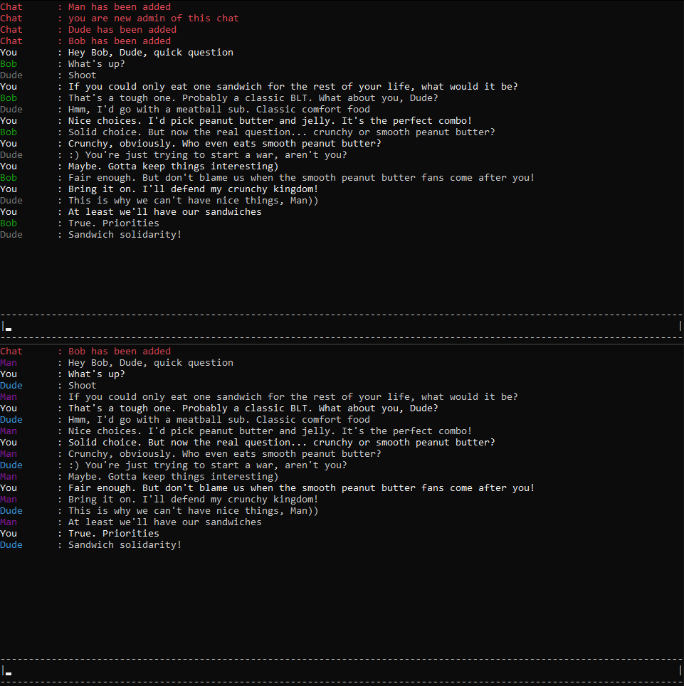

# cli-chat

This is a simple cli messaging application built with Go. Users can create rooms and chat with other in real-time. The application uses TCP for real-time communication.

## Features
- Create rooms with unique name
- Invite others by sharing the room name
- Real-time messaging
- Leave and join notifications
- Kick other members and give them admin rights

## Requirements
- Go 1.22

## Running the application
1. Clone the repository
2. Run `make build` inside the main directory to create client and server .exe files
3. Open the port you specified in the environment
4. Navigate to the `out` directory and run `server.exe` to start the server
5. Share the `client.exe` with your friends so they can connect to your server

## Contributing
This is a hobby project and I currently don't have any serious plans for it. However, if you find a bug or have a feature request, feel free to open an issue or submit a pull request.

## License
This project is licensed under the MIT License - see the [LICENSE](LICENSE) file for details.